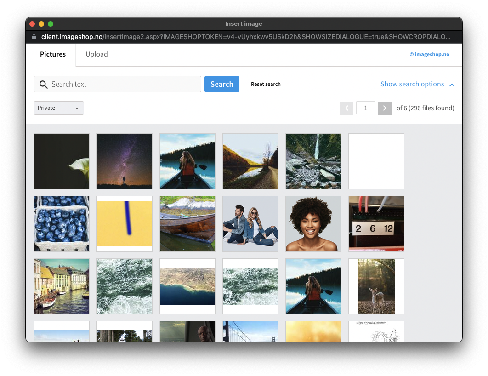

# Official Imageshop plugin for Craft CMS

This official plugin integrates [Imageshop Digital Asset Management system](https://www.imageshop.org) with Craft CMS by exposing
their image selector as a popup that saves the selected image data in a field so the selection
can be used in twig templates.


 


# Installation

To install the plugin, follow these instructions.

- Open your terminal and go to your Craft project:

````
cd /path/to/project
````

- Then tell Composer to load the plugin:

```
composer require webdna/imageshop-dam
```

- In the Control Panel, go to Settings → Plugins and click the “Install” button for 'Imageshop'.

OR do it via the command line

```
php craft plugin/install imageshop-dam
```

- On the settings page, fill out the token and private key field to start using the plugin.

- You will now have access to the "Imageshop" in the Field type dropdown on the field creation page.


## Templating:


### Plain and simple

```twig

```

### Using Imager

## Single size

```twig


```


## Multiple sizes
```twig



    

```


## Responsive images with srcset

```twig



```


### Available attributes

```imageshopField``` is the name of the field in these examples.

 ```twig
Code:           {{ entry.imageshopField.code }}
Image:          {{ entry.imageshopField.image }}
Tags:           {{ entry.imageshopField.tags("no") | join(", ") }}
Title:          {{ entry.imageshopField.title }}
Rights:         {{ entry.imageshopField.rights }}
Description:    {{ entry.imageshopField.description }}
Credit:         {{ entry.imageshopField.credits }}
DocumentId:     {{ entry.imageshopField.documentId }}
Raw:            {{ entry.imageshopField.json | json_encode(constant("JSON_PRETTY_PRINT")) }}
```


